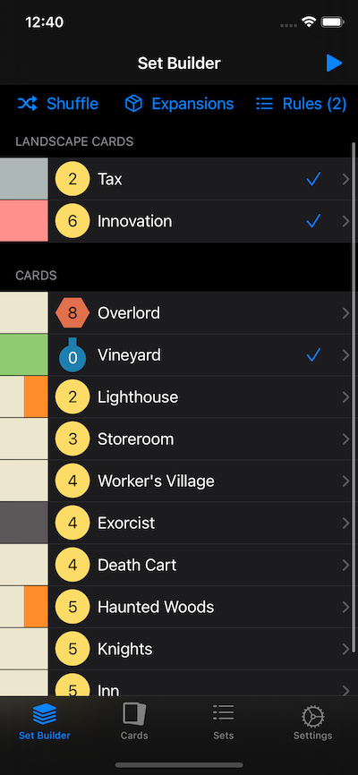
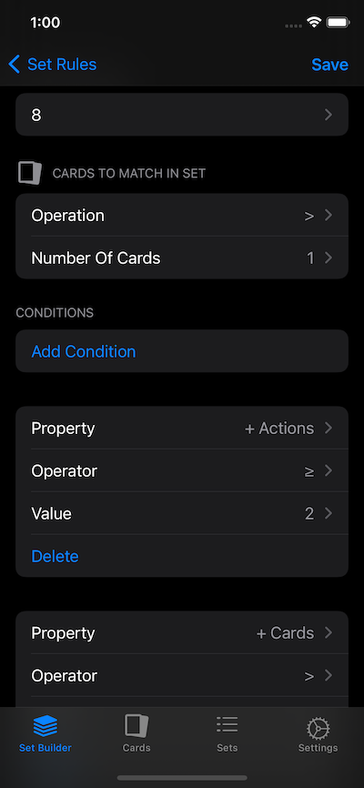
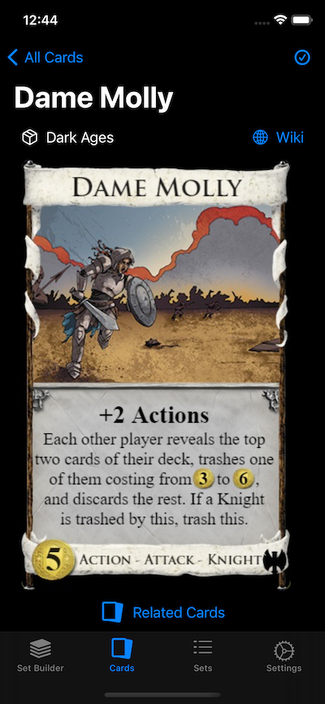
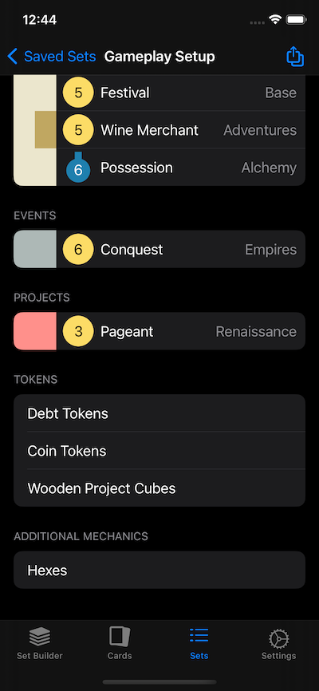

# DominionCompanion

 

[Download on the App Store!](https://apps.apple.com/us/app/dominioncompanion/id1493154264)

DominionCompanion is an iOS app for building sets for the strategy game [Dominion](https://www.riograndegames.com/games/dominion/). It allows for constructing complex sets of rules for finding a set of cards to play with, and listing exactly what cards and tokens are needed to set up and play.

## Features

- Use for complete random set building
- Pin specific cards to be included in a set and fill in the rest
- Create rules to ensure some number of the cards in a set match a set of conditions
  - Conditions can be created on card cost, card draw, actions, buys, victory token generation, coin/coffer token generation, type and more
- Save sets of rules to be recalled later to build certain types of sets
- Exclude cards globally from being used in any set
- Gameplay Setup summary screen showing all the required cards and token to play a given set
- Save sets to play again later
- See all recommended sets from the expansion booklets

## Contributing

Please see the [contribution guide](./.github/CONTRIBUTING.md) if you'd like to contribute a feature, or an idea!